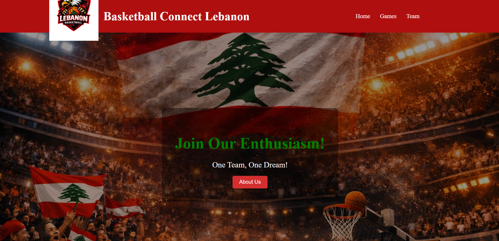
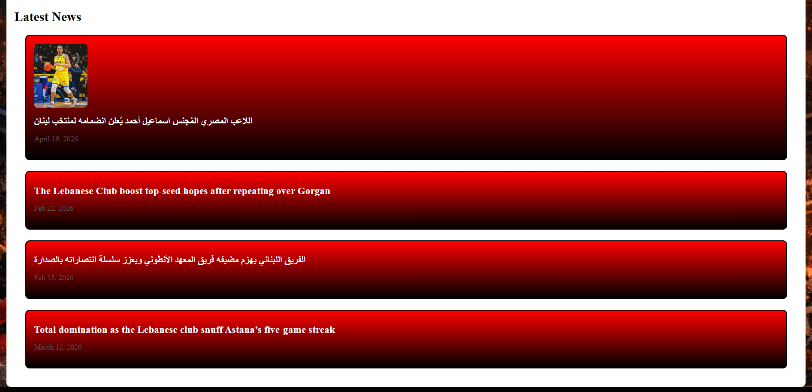
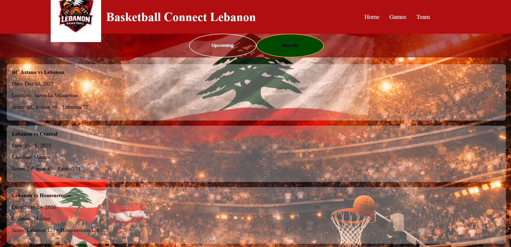
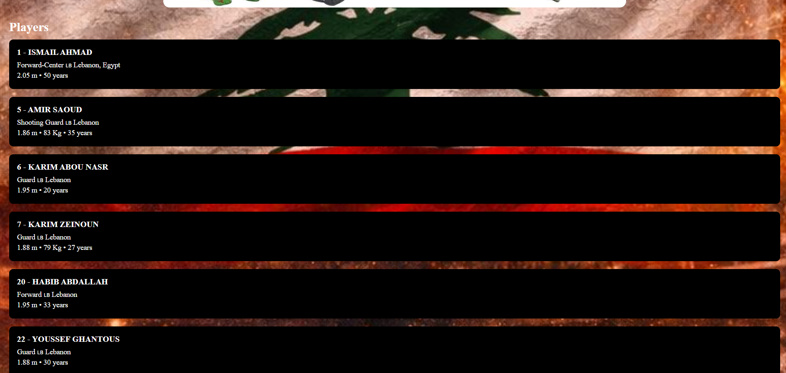

## Project Title  
Lebanese Basketball Web App

## Project Description
The Lebanese Basketball Web App is a ReactJS frontend application designed to showcase Lebanese basketball teams, games, and related information. The project demonstrates modern web design principles, responsive UI/UX, and version control practices using Git and GitHub.  

The application includes four main pages:
- **Welcome Page**: When you click (Basketball Connect Lebanon) Introduces users to the site and provides a friendly entry point.  
- **Home Page**: Serves as the central hub with general information and navigation.  
- **Games Page**: Displays schedules, results, or highlights of basketball matches.  
- **Team Page**: Presents team details, player information, and roster insights.  

This project highlights responsive design (works on desktop and mobile), uses Tailwind CSS for styling, and is deployed online for easy access.

## Setup Instructions
1. Clone the repository
2. Run `npm install`
3. Run `npm start`

## Screenshots

## Technologies Used
- ReactJS
- Tailwind CSS
- Git & GitHub
- Vercel